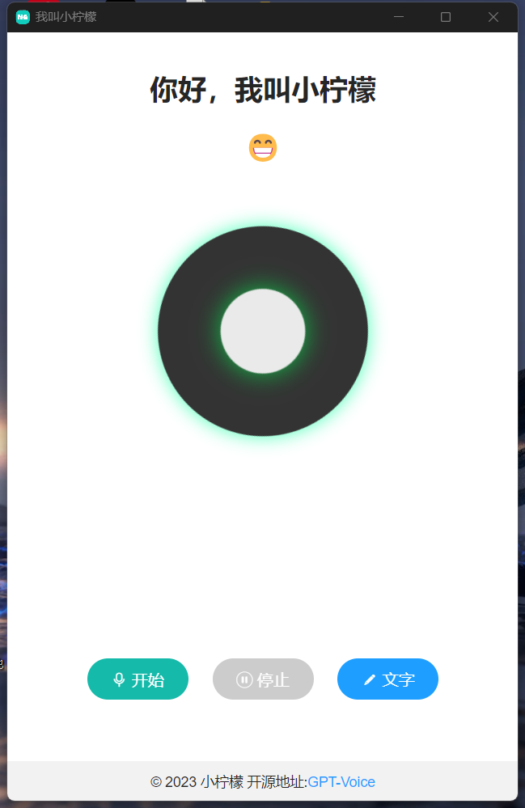
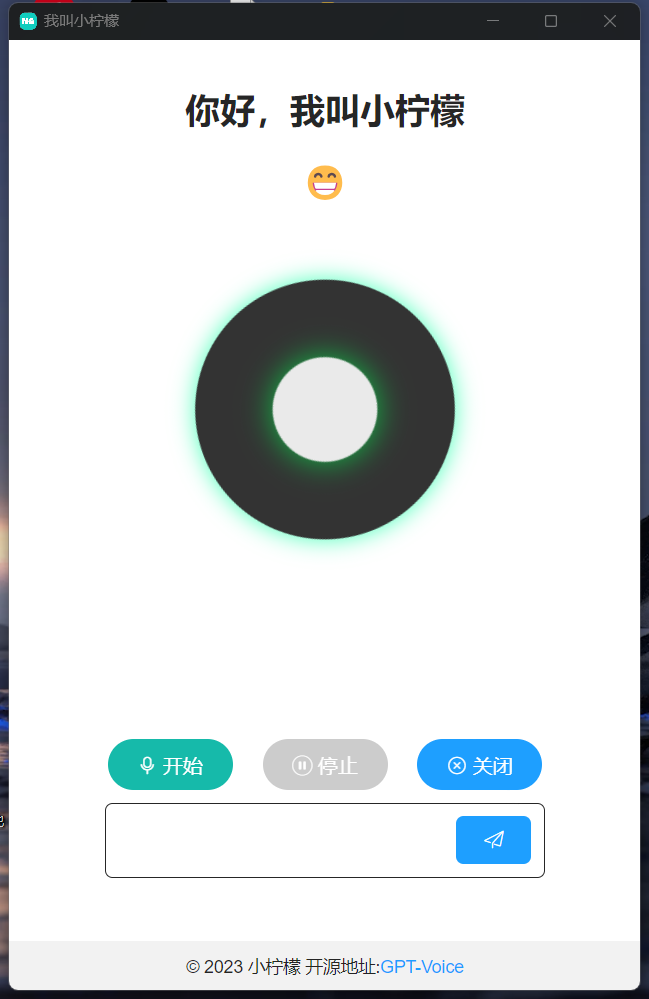

# GPT-Voice

## 一个简单的GPT语音对话网页

### 说明
- 一个简单的ChatGPT语音对话网站
- 主打的就是简单，容易改，随便改
- 有我打包好的我网页套壳的桌面版，需要自行下载

### 部署

- 在仓库中下载源码
  
- 上传源码解压到根目录

- 打开config.php文件中填入反代和你的apikey

- 如果你想使用其他的模型，可以在config.php中的$gptmodel中更改你想要的模型即可

### 功能

- 前端原生JS，后端使用PHP实现语音对话。

- 支持最大5条的上下文聊天，可以在代码中修改最大上下文的条数。

- 点击开始就录制，点击停止就发送请求后端返回音频，音频自动播放。

- 如果在微信浏览器上打开，会显示音频组件，需要自己点击播放。

- 如果不想语音，也可以发送文字，然后语音回答。

### 实现原理

- 主要是利用openai的api接口，首先在前端录制语音文件发送到后端，后端再把该录音文件请求openai的whisper-1模型进行把语音转化为文字，然后再把该文字发送请求到oenai的gpt接口，然后把gpt回答的内容再请求openai的tts模型进行文字转语音，然后再把语音保存到本地，输出文件目录到前端进行播放。

### 使用技术
- JavaScript
- layui
- PHP

## 网页的UI效果图

### 赞赏
-  如果你认为该项目对你有用，记得给我个小小的star
-  如果你认为该项目对你有用，可以给我个小小赞赏

